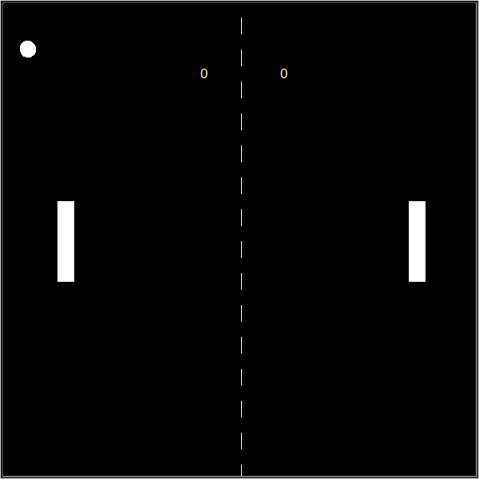

# 🏓 Pong (2-Player)

A two-player version of the classic Pong arcade game, built in Python with the `turtle` graphics library.



## Controls
| Player | Up | Down |
|--------|----|------|
| Left   | `W` | `S` |
| Right  | `↑` | `↓` |

## Features
- Ball bounces off the top/bottom walls and the paddles
- Live scoreboard for both players
- First player to 5 points wins

## How to run
Requires Python 3 (the `turtle` module is included with Python).

```bash
python pong_game.py
```

## Project structure
| File | Purpose |
|------|---------|
| `pong_game.py` | Main game loop |
| `ball.py` | Ball movement and bouncing |
| `Saddle.py` | Paddle class |
| `Score.py` | Scoreboard |
| `line.py` | Draws the centre line |

## What I learned
Structuring a game into classes, handling input from two players, and collision detection.

---
Built while following Dr. Angela Yu's *100 Days of Code: The Complete Python Pro Bootcamp* (Udemy).
